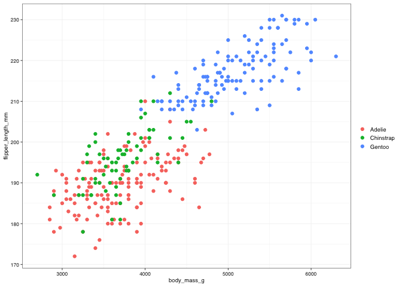
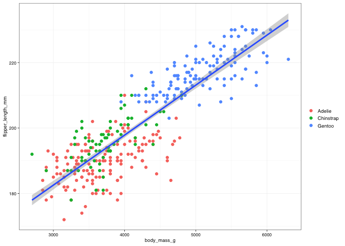
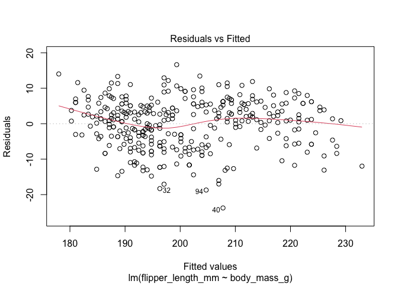
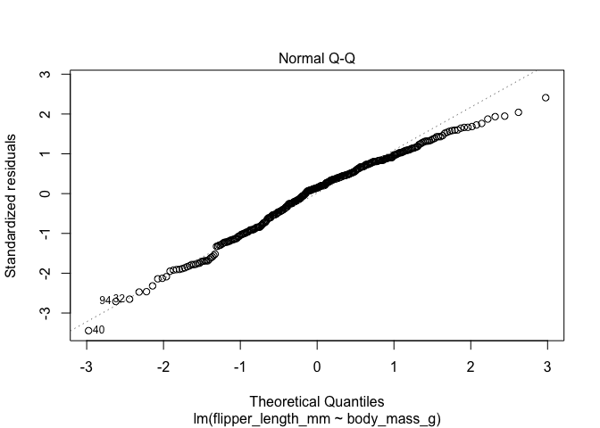
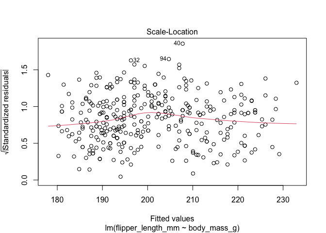
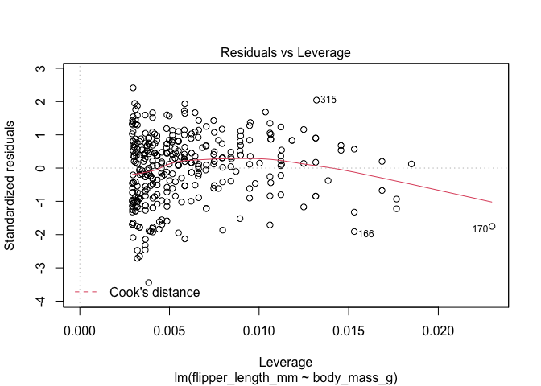
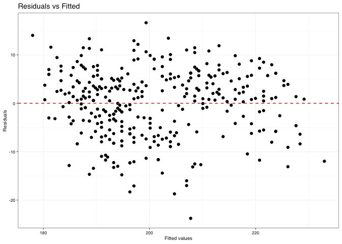
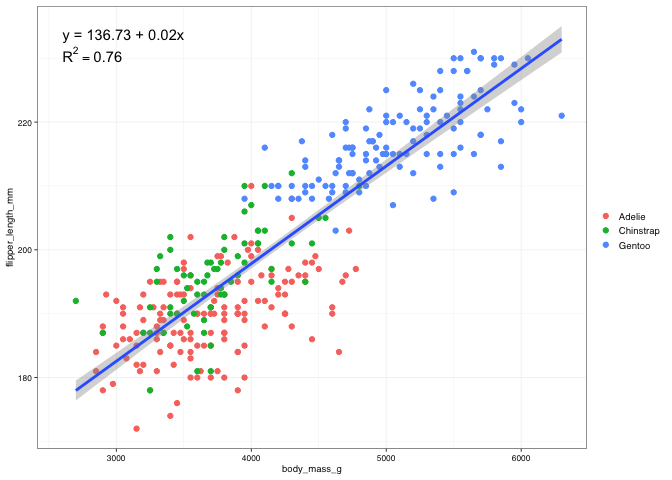
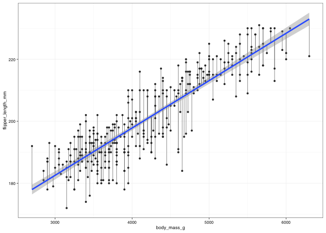

I have mentioned many times that this is not a stats course, however, not even i can ignore the fact that one of the main purpuses of R is to help you on statistical analysis. The goal of this section **is not** to teach you how to fit linear models to your data. In fact you should not learn stats from me (heck! i am not even going to test the assumptions!), but to show you how to handle the output of a model and extract the info you want from it. This skill can be applied to the output of pretty much anything in R and i am sure it will come handy.

# Some basic linear regression in R

For this part we are going to use the [Palmer Penguins](https://github.com/allisonhorst/palmerpenguins) dataset.

Let's take a look at the data (remember that it gets loaded with the `palmerpenguins` package, so you just need to call `penguins`)"


```r
penguins
```

```
## # A tibble: 344 x 8
##    species island bill_length_mm bill_depth_mm flipper_length_… body_mass_g
##    <fct>   <fct>           <dbl>         <dbl>            <int>       <int>
##  1 Adelie  Torge…           39.1          18.7              181        3750
##  2 Adelie  Torge…           39.5          17.4              186        3800
##  3 Adelie  Torge…           40.3          18                195        3250
##  4 Adelie  Torge…           NA            NA                 NA          NA
##  5 Adelie  Torge…           36.7          19.3              193        3450
##  6 Adelie  Torge…           39.3          20.6              190        3650
##  7 Adelie  Torge…           38.9          17.8              181        3625
##  8 Adelie  Torge…           39.2          19.6              195        4675
##  9 Adelie  Torge…           34.1          18.1              193        3475
## 10 Adelie  Torge…           42            20.2              190        4250
## # … with 334 more rows, and 2 more variables: sex <fct>, year <int>
```


Let's look, for example, at the relationship between the body weight and the length of the flippers


```r
penguins %>% 
  ggplot() +
  geom_point(aes(x = body_mass_g, y = flipper_length_mm, colour = species)) +
  theme_pepe()
```

```
## Warning: Removed 2 rows containing missing values (geom_point).
```

<!-- -->

There seems to be a bit of a correlation there. We saw on the first ggplot class that we can fit a regression directly in ggplot:


```r
penguins %>% 
  ggplot() +
  geom_point(aes(x = body_mass_g, y = flipper_length_mm, colour = species)) +
  geom_smooth(aes(x = body_mass_g, y = flipper_length_mm), method = "lm") +
  theme_pepe()
```

```
## `geom_smooth()` using formula 'y ~ x'
```

```
## Warning: Removed 2 rows containing non-finite values (stat_smooth).
```

```
## Warning: Removed 2 rows containing missing values (geom_point).
```

<!-- -->

But this approach only helps with visualization, it does not give us the regression estimates or any other statistical information about the model and its fit. So how do we run a linear regression in R?

In order to fit a linear model in R we use the `lm()` function


```r
model_1 <- lm(flipper_length_mm ~ body_mass_g, data = penguins)

print(model_1)
```

```
## 
## Call:
## lm(formula = flipper_length_mm ~ body_mass_g, data = penguins)
## 
## Coefficients:
## (Intercept)  body_mass_g  
##   136.72956      0.01528
```

Just by using `print()` in the model object we already get very important info, such as the description of the model that was fit and the estimates for the slope and the intercept.


**Note about using the pipe with the `lm()` function**

Unfortunately the `lm()` function asks for the data at the end of the list of reuired info (instead of being the first thing like most functions), this leads to errors when you try to apply the `lm()` in a pip workflow:


```r
# penguins %>% 
# lm(flipper_length_mm ~ body_mass_g)
```

Bu there are ways around it. We can directly specify where the element coming from the pipe should go using the **"."** symbol. That aproach can be used for any function in a pipe, most times it is not needed, but you can always use it.


```r
penguins %>% 
lm(flipper_length_mm ~ body_mass_g, data = .)
```

```
## 
## Call:
## lm(formula = flipper_length_mm ~ body_mass_g, data = .)
## 
## Coefficients:
## (Intercept)  body_mass_g  
##   136.72956      0.01528
```

**End of note**

We were looking at the output of the model


```r
print(model_1)
```

```
## 
## Call:
## lm(formula = flipper_length_mm ~ body_mass_g, data = penguins)
## 
## Coefficients:
## (Intercept)  body_mass_g  
##   136.72956      0.01528
```


There are a couple of other useful functions to show us the results of this model:


```r
summary(model_1)
```

```
## 
## Call:
## lm(formula = flipper_length_mm ~ body_mass_g, data = penguins)
## 
## Residuals:
##      Min       1Q   Median       3Q      Max 
## -23.7626  -4.9138   0.9891   5.1166  16.6392 
## 
## Coefficients:
##              Estimate Std. Error t value Pr(>|t|)    
## (Intercept) 1.367e+02  1.997e+00   68.47   <2e-16 ***
## body_mass_g 1.528e-02  4.668e-04   32.72   <2e-16 ***
## ---
## Signif. codes:  0 '***' 0.001 '**' 0.01 '*' 0.05 '.' 0.1 ' ' 1
## 
## Residual standard error: 6.913 on 340 degrees of freedom
##   (2 observations deleted due to missingness)
## Multiple R-squared:  0.759,	Adjusted R-squared:  0.7583 
## F-statistic:  1071 on 1 and 340 DF,  p-value: < 2.2e-16
```

`summary()` gives us some extra info, such as a summary of the distribution of the residuals (to help us assessing the fit), more statistical information related to the intercept and slope (seems like the effect of body mass on flipper length is signifficant) and, of course, the famous R-squared and its adjusted version.


```r
anova(model_1)
```

```
## Analysis of Variance Table
## 
## Response: flipper_length_mm
##              Df Sum Sq Mean Sq F value    Pr(>F)    
## body_mass_g   1  51176   51176  1070.7 < 2.2e-16 ***
## Residuals   340  16250      48                      
## ---
## Signif. codes:  0 '***' 0.001 '**' 0.01 '*' 0.05 '.' 0.1 ' ' 1
```

`anova()` gives us a different version of the output with the very useful ANOVA table that should be included with the results of any model you run.


```r
plot(model_1)
```

<!-- --><!-- --><!-- --><!-- -->
Using `plot()` (the base R plotting function) on a lm model output will automatically generate 4 descriptive plots to help yu assess the fit of the model, including the famous **Q-Q plot** to see if your residuals are normally distributed (I guess i am checking the assumptions after all..)

Now.... all these aproaches have a common limitation... **How the hell do i get that data out of R?**. If yu are running one model... then it is quite simple to just try to copy-paste those values (p-values, R-square, etc) off the terminal, or the `.md` document, or just write them down, but what if you are trying to fit hundreds of models?? or you just know that you can **do better** than copy-pasting?

In order to understand how the `model_1` object is structured we need to do some digging. The `model_1` object is basically a **list** (like the ones we saw in the first weeks), however R is quite smart, so it automatically knows that the `model_1` object is the output of a linear model. This is good, as that is how it knew to show us the model results, but it is also a bit harder to see the contents of the list. Lets see an example.


```r
example_list <- list(c(1,2,3,4,5),
                     c("a", "b", "c"),
                     matrix(c(1,2,3,4,5,6), ncol = 3))

example_list
```

```
## [[1]]
## [1] 1 2 3 4 5
## 
## [[2]]
## [1] "a" "b" "c"
## 
## [[3]]
##      [,1] [,2] [,3]
## [1,]    1    3    5
## [2,]    2    4    6
```


```r
model_1
```

```
## 
## Call:
## lm(formula = flipper_length_mm ~ body_mass_g, data = penguins)
## 
## Coefficients:
## (Intercept)  body_mass_g  
##   136.72956      0.01528
```

Now, if you look to the environment, you will see that both the `example_list` and `model_1` appear as lists and they have the little blue down arrow.

We can use the ways we saw to **"navigate"** through a list to look at the things inside of `model_1`

for example, the first element is the coefficients


```r
model_1[[1]]
```

```
##  (Intercept)  body_mass_g 
## 136.72955927   0.01527592
```

Also note how the elements of `model_1` are actually names (we saw how to do this in the first few weeks), so we can access them by their names


```r
model_1$coefficients
```

```
##  (Intercept)  body_mass_g 
## 136.72955927   0.01527592
```


You can let the **autofill** help you find what you are looking for


```r
model_1
```

```
## 
## Call:
## lm(formula = flipper_length_mm ~ body_mass_g, data = penguins)
## 
## Coefficients:
## (Intercept)  body_mass_g  
##   136.72956      0.01528
```

you can check in the help document what each thing is


```r
?lm()
```


This way we can actually **use** the stuff in there!! including making our own plots


```r
ggplot() +
  geom_point(aes(x = model_1$fitted.values, y = model_1$residuals)) +
  geom_hline(aes(yintercept = 0), colour = "red", linetype = "dashed") +
  theme_pepe() +
  labs(title = "Residuals vs Fitted",
       x = "Fitted values",
       y = "Residuals")
```

<!-- -->

Other information that we need is not in the `model_1` directly and we might need to look in the summaries


```r
model_1_summary <- summary(model_1)

model_1_summary
```

```
## 
## Call:
## lm(formula = flipper_length_mm ~ body_mass_g, data = penguins)
## 
## Residuals:
##      Min       1Q   Median       3Q      Max 
## -23.7626  -4.9138   0.9891   5.1166  16.6392 
## 
## Coefficients:
##              Estimate Std. Error t value Pr(>|t|)    
## (Intercept) 1.367e+02  1.997e+00   68.47   <2e-16 ***
## body_mass_g 1.528e-02  4.668e-04   32.72   <2e-16 ***
## ---
## Signif. codes:  0 '***' 0.001 '**' 0.01 '*' 0.05 '.' 0.1 ' ' 1
## 
## Residual standard error: 6.913 on 340 degrees of freedom
##   (2 observations deleted due to missingness)
## Multiple R-squared:  0.759,	Adjusted R-squared:  0.7583 
## F-statistic:  1071 on 1 and 340 DF,  p-value: < 2.2e-16
```

we can *"dig"* through these objects too


```r
model_1_summary$r.squared
```

```
## [1] 0.7589925
```


```r
penguins %>% 
  ggplot() +
  geom_point(aes(x = body_mass_g, y = flipper_length_mm, colour = species)) +
  geom_smooth(aes(x = body_mass_g, y = flipper_length_mm), method = "lm") +
  
  annotate(geom = "text",
           x = 2600,
           y = 233,
           label = str_c("y = ", 
                         round(model_1$coefficients[[1]], digits = 2),
                         " + ",
                         round(model_1$coefficients[[2]], digits = 2),
                         "x",
                         sep = ""),
           hjust = 0,
           vjust = 0) +

  annotate(geom = "text",
           x = 2600,
           y = 233,
           label = str_c('R^2 == ', round(model_1_summary$r.squared, digits = 2)),
           parse = TRUE,
           hjust = 0,
           vjust = 1.5) +

  theme_pepe()
```

```
## `geom_smooth()` using formula 'y ~ x'
```

```
## Warning: Removed 2 rows containing non-finite values (stat_smooth).
```

```
## Warning: Removed 2 rows containing missing values (geom_point).
```

<!-- -->


# Using `{Broom}` to make our life easier 

`{Brrom}` is a [package](https://broom.tidymodels.org/) within the [`Tidymodels` environment](https://github.com/tidymodels/tidymodels). You can download it on its own or as part of `Tidymodels`. For this course, `{Broom}` on its own should be enough.

While it is not part of the `Tidyverse` it was developed with the Tidiverse philosophy. That means, it works well with al Tidyverse functions, t follows (usually) the Tidyverse style guide, and more importantly, **it's functions return tidy data!**

`{Brrom}` is specifically design to take the "mess" that is the output of a model and turn it into something we can, save, easily work with, and scale up!

Let's look at some of its tools.

## `broom::tidy()` put your main model output into a tidy table


```r
model_1_tidy <- tidy(model_1)

write_csv(model_1_tidy, here("results", "model_1.csv"))

model_1_tidy
```

```
## # A tibble: 2 x 5
##   term        estimate std.error statistic   p.value
##   <chr>          <dbl>     <dbl>     <dbl>     <dbl>
## 1 (Intercept) 137.      2.00          68.5 5.71e-201
## 2 body_mass_g   0.0153  0.000467      32.7 4.37e-107
```

you can apply `broom::tidy()` to the output of `anova()` to get a tidy version of the ANOVA table that you can throuw directly into your paper.


```r
model_1_tidy_anova <- tidy(anova(model_1))

write_csv(model_1_tidy_anova, here("results", "model_1_anova.csv"))

model_1_tidy_anova
```

```
## # A tibble: 2 x 6
##   term           df  sumsq  meansq statistic    p.value
##   <chr>       <int>  <dbl>   <dbl>     <dbl>      <dbl>
## 1 body_mass_g     1 51176. 51176.      1071.  4.37e-107
## 2 Residuals     340 16250.    47.8       NA  NA
```

## `broom::glance()` - similar to what we got from `summary()`, but more, and tidy


```r
model_1_gof <- glance(model_1)   # "gof" = "goodness of fit"

write_csv(model_1_gof, here("results", "model_1_gof.csv"))

model_1_gof
```

```
## # A tibble: 1 x 12
##   r.squared adj.r.squared sigma statistic   p.value    df logLik   AIC   BIC
##       <dbl>         <dbl> <dbl>     <dbl>     <dbl> <dbl>  <dbl> <dbl> <dbl>
## 1     0.759         0.758  6.91     1071. 4.37e-107     1 -1146. 2297. 2309.
## # … with 3 more variables: deviance <dbl>, df.residual <int>, nobs <int>
```

## `broom::augment()` - augment your original dataset with a bunch of model-related outputs


```r
augment(model_1)
```

```
## # A tibble: 342 x 9
##    .rownames flipper_length_… body_mass_g .fitted .resid .std.resid    .hat
##    <chr>                <int>       <int>   <dbl>  <dbl>      <dbl>   <dbl>
##  1 1                      181        3750    194. -13.0      -1.89  0.00385
##  2 2                      186        3800    195.  -8.78     -1.27  0.00366
##  3 3                      195        3250    186.   8.62      1.25  0.00705
##  4 5                      193        3450    189.   3.57      0.518 0.00550
##  5 6                      190        3650    192.  -2.49     -0.360 0.00431
##  6 7                      181        3625    192. -11.1      -1.61  0.00444
##  7 8                      195        4675    208. -13.1      -1.91  0.00395
##  8 9                      193        3475    190.   3.19      0.462 0.00533
##  9 10                     190        4250    202. -11.7      -1.69  0.00293
## 10 11                     186        3300    187.  -1.14     -0.165 0.00663
## # … with 332 more rows, and 2 more variables: .sigma <dbl>, .cooksd <dbl>
```

It is easier not to create our own diagnostic plots, like a Residuals Vs fitted


```r
augment(model_1) %>% 
  clean_names() %>% 
  ggplot() +
  geom_point(aes(x = fitted, y = resid)) +
  geom_hline(aes(yintercept = 0), colour = "red", linetype = "dashed") +
  theme_pepe() +
  labs(title = "Residuals vs Fitted",
       x = "Fitted values",
       y = "Residuals")
```

<!-- -->

It is much easier now to display the residuals if that was something we wanted to show.


```r
augment(model_1) %>% 
  clean_names() %>% 
  ggplot() +
  
  geom_segment(aes(x = body_mass_g, xend = body_mass_g,
                   y = flipper_length_mm, yend = fitted), size = 0.25, colour = "grey40") +
  
  geom_point(aes(x = body_mass_g, y = flipper_length_mm), colour = "grey20", stroke = 0) +
  geom_smooth(aes(x = body_mass_g, y = flipper_length_mm), method = "lm") +
  
  
  theme_pepe()
```

```
## `geom_smooth()` using formula 'y ~ x'
```

<!-- -->


WE are using the `{broom}` tools with the output of `lm()` but it works with the output of a bunch of other functions used for more complex models and statistics, such as non-linear models, generalized linear models and many others.

you can check what is available asking:


```r
vignette("available-methods")
```

```
## starting httpd help server ... done
```

