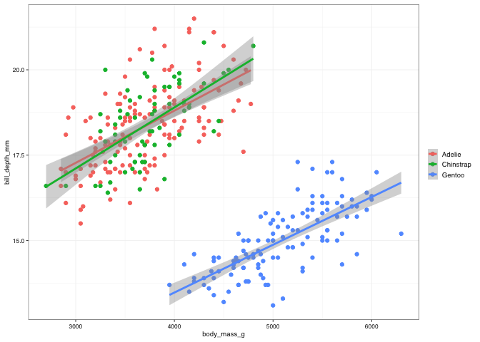
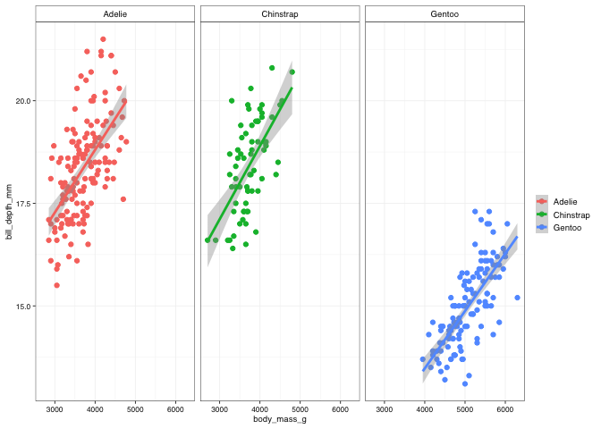
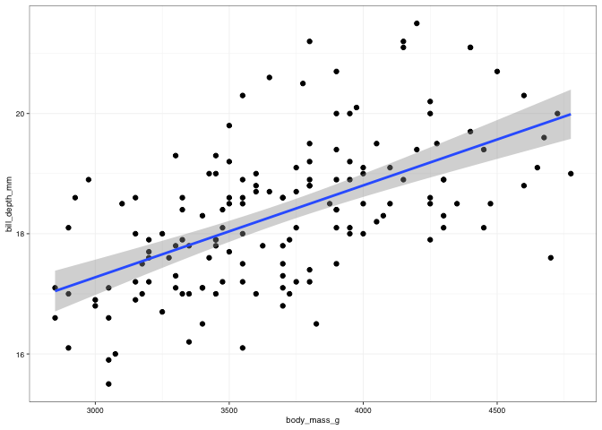
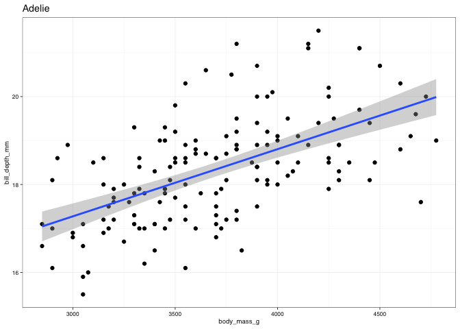
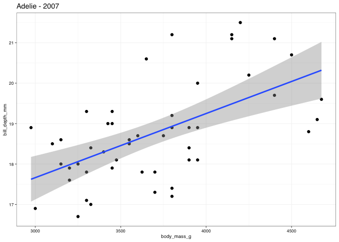

# Nested tibbles

The **Tidyverse** `tibble` has another advantage over the traditional `data.frame` and that is that it can accept nested data.

You can read more about **nested data formats** in this [entry](https://tidyr.tidyverse.org/articles/nest.html) in the tidiverse. Technically is almost equivalent to a named list, but it is displayed in a table format which makes it very intuitive to use.


```r
nested_penguins <- penguins %>% 
  group_by(species) %>% 
  nest()

print(nested_penguins)
```

```
## # A tibble: 3 x 2
## # Groups:   species [3]
##   species   data              
##   <fct>     <list>            
## 1 Adelie    <tibble [152 × 7]>
## 2 Gentoo    <tibble [124 × 7]>
## 3 Chinstrap <tibble [68 × 7]>
```

Th `data` column that was reated now contains the subset datasets for each of the species.

You can see, that if we request that column, what we get is a list with three datasets.

NOTE: Please note how the variable `species` **does not** appear in these subsets, as it is its own column outside the subset data.


```r
nested_penguins$data
```

```
## [[1]]
## # A tibble: 152 x 7
##    island  bill_length_mm bill_depth_mm flipper_length_… body_mass_g sex    year
##    <fct>            <dbl>         <dbl>            <int>       <int> <fct> <int>
##  1 Torger…           39.1          18.7              181        3750 male   2007
##  2 Torger…           39.5          17.4              186        3800 fema…  2007
##  3 Torger…           40.3          18                195        3250 fema…  2007
##  4 Torger…           NA            NA                 NA          NA <NA>   2007
##  5 Torger…           36.7          19.3              193        3450 fema…  2007
##  6 Torger…           39.3          20.6              190        3650 male   2007
##  7 Torger…           38.9          17.8              181        3625 fema…  2007
##  8 Torger…           39.2          19.6              195        4675 male   2007
##  9 Torger…           34.1          18.1              193        3475 <NA>   2007
## 10 Torger…           42            20.2              190        4250 <NA>   2007
## # … with 142 more rows
## 
## [[2]]
## # A tibble: 124 x 7
##    island bill_length_mm bill_depth_mm flipper_length_mm body_mass_g sex    year
##    <fct>           <dbl>         <dbl>             <int>       <int> <fct> <int>
##  1 Biscoe           46.1          13.2               211        4500 fema…  2007
##  2 Biscoe           50            16.3               230        5700 male   2007
##  3 Biscoe           48.7          14.1               210        4450 fema…  2007
##  4 Biscoe           50            15.2               218        5700 male   2007
##  5 Biscoe           47.6          14.5               215        5400 male   2007
##  6 Biscoe           46.5          13.5               210        4550 fema…  2007
##  7 Biscoe           45.4          14.6               211        4800 fema…  2007
##  8 Biscoe           46.7          15.3               219        5200 male   2007
##  9 Biscoe           43.3          13.4               209        4400 fema…  2007
## 10 Biscoe           46.8          15.4               215        5150 male   2007
## # … with 114 more rows
## 
## [[3]]
## # A tibble: 68 x 7
##    island bill_length_mm bill_depth_mm flipper_length_mm body_mass_g sex    year
##    <fct>           <dbl>         <dbl>             <int>       <int> <fct> <int>
##  1 Dream            46.5          17.9               192        3500 fema…  2007
##  2 Dream            50            19.5               196        3900 male   2007
##  3 Dream            51.3          19.2               193        3650 male   2007
##  4 Dream            45.4          18.7               188        3525 fema…  2007
##  5 Dream            52.7          19.8               197        3725 male   2007
##  6 Dream            45.2          17.8               198        3950 fema…  2007
##  7 Dream            46.1          18.2               178        3250 fema…  2007
##  8 Dream            51.3          18.2               197        3750 male   2007
##  9 Dream            46            18.9               195        4150 fema…  2007
## 10 Dream            51.3          19.9               198        3700 male   2007
## # … with 58 more rows
```

Using the methos we already know of how to navigate data frames and lists, we can request one of those subsets if we want.


```r
nested_penguins$data[[1]]
```

```
## # A tibble: 152 x 7
##    island  bill_length_mm bill_depth_mm flipper_length_… body_mass_g sex    year
##    <fct>            <dbl>         <dbl>            <int>       <int> <fct> <int>
##  1 Torger…           39.1          18.7              181        3750 male   2007
##  2 Torger…           39.5          17.4              186        3800 fema…  2007
##  3 Torger…           40.3          18                195        3250 fema…  2007
##  4 Torger…           NA            NA                 NA          NA <NA>   2007
##  5 Torger…           36.7          19.3              193        3450 fema…  2007
##  6 Torger…           39.3          20.6              190        3650 male   2007
##  7 Torger…           38.9          17.8              181        3625 fema…  2007
##  8 Torger…           39.2          19.6              195        4675 male   2007
##  9 Torger…           34.1          18.1              193        3475 <NA>   2007
## 10 Torger…           42            20.2              190        4250 <NA>   2007
## # … with 142 more rows
```

Because the basis for this nesting is `group_by()` we get all the functionality of the function, including the ability to group by various variables at once.

If we group by species and year, we get all unique combinations of those two elements, now with their speciffic subsets of data as a separate column (ote that neither species, nor year are columns of the subset.)


```r
penguins %>% 
  group_by(species, year) %>% 
  nest()
```

```
## # A tibble: 9 x 3
## # Groups:   species, year [9]
##   species    year data             
##   <fct>     <int> <list>           
## 1 Adelie     2007 <tibble [50 × 6]>
## 2 Adelie     2008 <tibble [50 × 6]>
## 3 Adelie     2009 <tibble [52 × 6]>
## 4 Gentoo     2007 <tibble [34 × 6]>
## 5 Gentoo     2008 <tibble [46 × 6]>
## 6 Gentoo     2009 <tibble [44 × 6]>
## 7 Chinstrap  2007 <tibble [26 × 6]>
## 8 Chinstrap  2008 <tibble [18 × 6]>
## 9 Chinstrap  2009 <tibble [24 × 6]>
```

# working iteratively through data with **purrr**

Now that we are familiar with nested tibbles, lets see what we can do with them.

## Example I - Generating multiple plots at once

For This first section we are going to use the **Palmer Penguins** data set. In particular, we are going to look at the relationship between body mass and the depth of the bill (measure of the beak). 
Let's take a look at how this relationship looks like:


```r
penguins %>% 
  ggplot() +
  geom_point(aes(x = body_mass_g, y = bill_depth_mm, colour = species)) +
  geom_smooth(aes(x = body_mass_g, y = bill_depth_mm, colour = species), method = "lm") +
  theme_pepe()
```

```
## `geom_smooth()` using formula 'y ~ x'
```

```
## Warning: Removed 2 rows containing non-finite values (stat_smooth).
```

```
## Warning: Removed 2 rows containing missing values (geom_point).
```

<!-- -->

What if we wanted to have individual figures for each of the species?

We could create a panel with `facet_wrap()` as we have already seen...


```r
penguins %>% 
  ggplot() +
  facet_wrap(~species) +
  geom_point(aes(x = body_mass_g, y = bill_depth_mm, colour = species)) +
  geom_smooth(aes(x = body_mass_g, y = bill_depth_mm, colour = species), method = "lm") +
  theme_pepe()
```

```
## `geom_smooth()` using formula 'y ~ x'
```

```
## Warning: Removed 2 rows containing non-finite values (stat_smooth).
```

```
## Warning: Removed 2 rows containing missing values (geom_point).
```

<!-- -->

but what is we actually wanted **individual** files for each species? would we need to create them one by one?

**Spoiler**: no, you do not have to make them one by one! that would be a pain with three species, but just impossible if we had hundreds!

Fortunately, the function `purrr::map()` is a very powerful function that allows us to iterate through the rows of a tibble and use information contained in one (or several) of the columns to apply some calculation or function (e.g. making a plot). 

Generally it gets applied as part of a `mutate()` so the output can become a new column.


```r
nested_plots <- penguins %>% 
  group_by(species) %>% 
  nest() %>% 
  mutate(plot = map(.x = data,        # in map() the ".x = " allows us to indicate the column that we want to iterate through (in this case the "data" column)
                    ~ ggplot() +      # now we tell map() what do we want to do with that data. for that we use the "~"
                      geom_point(data = .x, aes(x = body_mass_g, y = bill_depth_mm)) +   # Remember we are not downstream of a pipe, so wwe need to specidy the data
                      geom_smooth(data = .x, aes(x = body_mass_g, y = bill_depth_mm), method = "lm") +
                      theme_pepe()
                    )
         )

print(nested_plots)
```

```
## # A tibble: 3 x 3
## # Groups:   species [3]
##   species   data               plot  
##   <fct>     <list>             <list>
## 1 Adelie    <tibble [152 × 7]> <gg>  
## 2 Gentoo    <tibble [124 × 7]> <gg>  
## 3 Chinstrap <tibble [68 × 7]>  <gg>
```

WWe get a new column (`plot`) which holds the ggplot objects (i.e. the plots). We can use the approaches that we already know to "dig" through this dataset and grab the parts that we want:


```r
nested_plots$plot[[1]]
```

```
## `geom_smooth()` using formula 'y ~ x'
```

```
## Warning: Removed 1 rows containing non-finite values (stat_smooth).
```

```
## Warning: Removed 1 rows containing missing values (geom_point).
```

<!-- -->

We do have a small problem, though, there is no information in the figure as to what species the figure is about!

How would we go about adding that information to the figure?

The function `map2()` allow us to reference **2 column**s of the nested tibble to be used in the iteration.


```r
nested_plots_2 <- penguins %>% 
  group_by(species) %>% 
  nest() %>% 
  mutate(plot = map2(.x = species, .y = data,   # Now we need to reference two columns, one as ".x" and the other as ".y"
                     ~ ggplot() +
                       geom_point(data = .y, aes(x = body_mass_g, y = bill_depth_mm)) +
                       geom_smooth(data = .y, aes(x = body_mass_g, y = bill_depth_mm), method = "lm") +
                       theme_pepe() +
                       labs(title = .x)
                     )
         )

print(nested_plots_2)
```

```
## # A tibble: 3 x 3
## # Groups:   species [3]
##   species   data               plot  
##   <fct>     <list>             <list>
## 1 Adelie    <tibble [152 × 7]> <gg>  
## 2 Gentoo    <tibble [124 × 7]> <gg>  
## 3 Chinstrap <tibble [68 × 7]>  <gg>
```
Now you can see that the figure proudly displays the name of the species.


```r
nested_plots_2$plot[[1]]
```

```
## `geom_smooth()` using formula 'y ~ x'
```

```
## Warning: Removed 1 rows containing non-finite values (stat_smooth).
```

```
## Warning: Removed 1 rows containing missing values (geom_point).
```

<!-- -->

What if we wanted to use information contained in **more than 2 columns**?

The fucntion `pmap()` allows us to use information from **n columns** by providing a list of columns, then the different columns can be called based on their position in that list.

Because this is the most flexible version and the referencing of elements is more straight forward, **i would recommend you use this one** even when you only need data from one or two columns)


```r
nested_plots_3 <- penguins %>% 
  group_by(species, year) %>% # in this case, i am going to nest the data by species and year
  nest() %>% 
  mutate(plot = pmap(list(species, year, data), # now we provide a list of columns
                     ~ ggplot() +
                       geom_point(data = ..3, aes(x = body_mass_g, y = bill_depth_mm)) +
                       geom_smooth(data = ..3, aes(x = body_mass_g, y = bill_depth_mm), method = "lm") +
                       theme_pepe() +
                       labs(title = str_c(..1, ..2, sep = " - "))
                     )
         )

print(nested_plots_3)
```

```
## # A tibble: 9 x 4
## # Groups:   species, year [9]
##   species    year data              plot  
##   <fct>     <int> <list>            <list>
## 1 Adelie     2007 <tibble [50 × 6]> <gg>  
## 2 Adelie     2008 <tibble [50 × 6]> <gg>  
## 3 Adelie     2009 <tibble [52 × 6]> <gg>  
## 4 Gentoo     2007 <tibble [34 × 6]> <gg>  
## 5 Gentoo     2008 <tibble [46 × 6]> <gg>  
## 6 Gentoo     2009 <tibble [44 × 6]> <gg>  
## 7 Chinstrap  2007 <tibble [26 × 6]> <gg>  
## 8 Chinstrap  2008 <tibble [18 × 6]> <gg>  
## 9 Chinstrap  2009 <tibble [24 × 6]> <gg>
```
Now the figure shows the species name and the year!


```r
nested_plots_3$plot[[1]]
```

```
## `geom_smooth()` using formula 'y ~ x'
```

```
## Warning: Removed 1 rows containing non-finite values (stat_smooth).
```

```
## Warning: Removed 1 rows containing missing values (geom_point).
```

<!-- -->

Now... what if we wanted to save all these figures? would we need to do it one by one, or could we do it all at once?

Yeah, you guessed it, you can do it all at once!

We invoke `purrr::map()` when we want to modify or create a column with a new object or data. The related function `purrr::pwalk()` can be called when what we want is not a new or modified column but the *side effects* of a function (e.g. to save a plot)

So we can use `walk()` to iterate through the plots and apply `ggsave` to each of them. But before we need a couple of steps to make it easy for `pwalk()` to have all the info it needs.

Lets create a column called `filename` where we will use the 


```r
nested_plots_3 <- penguins %>% 
  group_by(species, year) %>% # in this case, i am going to nest the data by species and year
  nest() %>% 
  mutate(plot = pmap(list(species, year, data), # now we provide a list of columns
                    ~ ggplot() +
                      geom_point(data = ..3, aes(x = body_mass_g, y = bill_depth_mm)) +
                      geom_smooth(data = ..3, aes(x = body_mass_g, y = bill_depth_mm), method = "lm") +
                      theme_pepe() +
                      labs(title = str_c(..1, ..2, sep = " - "))
                    ),
         filename = str_c(species, year, "plot.pdf", sep = "_")
         )

print(nested_plots_3)
```

```
## # A tibble: 9 x 5
## # Groups:   species, year [9]
##   species    year data              plot   filename               
##   <fct>     <int> <list>            <list> <chr>                  
## 1 Adelie     2007 <tibble [50 × 6]> <gg>   Adelie_2007_plot.pdf   
## 2 Adelie     2008 <tibble [50 × 6]> <gg>   Adelie_2008_plot.pdf   
## 3 Adelie     2009 <tibble [52 × 6]> <gg>   Adelie_2009_plot.pdf   
## 4 Gentoo     2007 <tibble [34 × 6]> <gg>   Gentoo_2007_plot.pdf   
## 5 Gentoo     2008 <tibble [46 × 6]> <gg>   Gentoo_2008_plot.pdf   
## 6 Gentoo     2009 <tibble [44 × 6]> <gg>   Gentoo_2009_plot.pdf   
## 7 Chinstrap  2007 <tibble [26 × 6]> <gg>   Chinstrap_2007_plot.pdf
## 8 Chinstrap  2008 <tibble [18 × 6]> <gg>   Chinstrap_2008_plot.pdf
## 9 Chinstrap  2009 <tibble [24 × 6]> <gg>   Chinstrap_2009_plot.pdf
```

Now, to make it ieven easier for `pwalk()` we are just going to keep the two colums we want: `plot` and `filename`


```r
nested_plots_3b <- nested_plots_3 %>% 
  select(filename, plot)
```

```
## Adding missing grouping variables: `species`, `year`
```

hummmm... that didn't do what i wanted! I wanted to show this behaviour because you might encounter it in the future. If you have a grouped tibble, (i.e. you have applied `grou_by()` to it), it will force you to keep the columns you are grouping by. If you want to get rid of those columns, you need to use `ungrou()` first.


```r
nested_plots_3b <- nested_plots_3 %>% 
  ungroup() %>% 
  select(filename, plot)
```

now that we have just the plot and its filename, we can apply `pmap()`


```r
pwalk(nested_plots_3b,           # what we want to walk through
      ggsave,                    # what we want to do as we walk thorugh the object   
      path =  here("figures"),   # where we want to save it
      width = 190, height = 120, units = "mm") # other things you need for ggsave
```

```
## `geom_smooth()` using formula 'y ~ x'
```

```
## Warning: Removed 1 rows containing non-finite values (stat_smooth).
```

```
## Warning: Removed 1 rows containing missing values (geom_point).
```

```
## `geom_smooth()` using formula 'y ~ x'
## `geom_smooth()` using formula 'y ~ x'
## `geom_smooth()` using formula 'y ~ x'
## `geom_smooth()` using formula 'y ~ x'
## `geom_smooth()` using formula 'y ~ x'
```

```
## Warning: Removed 1 rows containing non-finite values (stat_smooth).

## Warning: Removed 1 rows containing missing values (geom_point).
```

```
## `geom_smooth()` using formula 'y ~ x'
## `geom_smooth()` using formula 'y ~ x'
## `geom_smooth()` using formula 'y ~ x'
```


# Example II - Applying models to data subsets

**DISCLAIMER**: This is not a stats course! I am going to show you how to bulk run a bunch of linear models at once. With great power comes great responsibility. Just because you can fit hundred's of models in one go it means it is appropriate to do so in every case. Review your stats knowledge to see how you can incorporate steps related to checking assumptions and assessing what models to fit. Make sre that what you are doing is apporpriate!


```r
penguins_models <- penguins %>% 
  group_by(species, year) %>% 
  nest() %>% 
  mutate(model = pmap(list(data),
                      ~ lm(bill_depth_mm ~ body_mass_g, data = ..1 )
                      )
         )
```

Just like before, we can inspect any of these model objects


```r
penguins_models$model[[1]]
```

```
## 
## Call:
## lm(formula = bill_depth_mm ~ body_mass_g, data = ..1)
## 
## Coefficients:
## (Intercept)  body_mass_g  
##   12.903564     0.001586
```

And because they are `lm()` objects, just lik ethe ones we saw in the first section of the class, we can apply `broom` tools to them

For example, we can tidy the model output with `tidy()`


```r
tidy(penguins_models$model[[1]])
```

```
## # A tibble: 2 x 5
##   term        estimate std.error statistic  p.value
##   <chr>          <dbl>     <dbl>     <dbl>    <dbl>
## 1 (Intercept) 12.9      1.21         10.7  3.63e-14
## 2 body_mass_g  0.00159  0.000324      4.89 1.22e- 5
```

Or we can check for the summary of important stats with `glance()`


```r
glance(penguins_models$model[[1]])
```

```
## # A tibble: 1 x 12
##   r.squared adj.r.squared sigma statistic p.value    df logLik   AIC   BIC
##       <dbl>         <dbl> <dbl>     <dbl>   <dbl> <dbl>  <dbl> <dbl> <dbl>
## 1     0.337         0.323  1.01      23.9 1.22e-5     1  -69.0  144.  150.
## # … with 3 more variables: deviance <dbl>, df.residual <int>, nobs <int>
```
Using what we know about "digging" thorugh objects, we can extract speciffic values, like the slope:


```r
tidy(penguins_models$model[[1]])$estimate[2]
```

```
## [1] 0.001586337
```

If we put it all toguether, we can create a new column to store any of these pieces of information that we'd like to keep:


```r
penguins_models %>% 
  mutate(intercept = map(.x = model,
                         ~ tidy(.x)$estimate[2])
         )
```

```
## # A tibble: 9 x 5
## # Groups:   species, year [9]
##   species    year data              model  intercept
##   <fct>     <int> <list>            <list> <list>   
## 1 Adelie     2007 <tibble [50 × 6]> <lm>   <dbl [1]>
## 2 Adelie     2008 <tibble [50 × 6]> <lm>   <dbl [1]>
## 3 Adelie     2009 <tibble [52 × 6]> <lm>   <dbl [1]>
## 4 Gentoo     2007 <tibble [34 × 6]> <lm>   <dbl [1]>
## 5 Gentoo     2008 <tibble [46 × 6]> <lm>   <dbl [1]>
## 6 Gentoo     2009 <tibble [44 × 6]> <lm>   <dbl [1]>
## 7 Chinstrap  2007 <tibble [26 × 6]> <lm>   <dbl [1]>
## 8 Chinstrap  2008 <tibble [18 × 6]> <lm>   <dbl [1]>
## 9 Chinstrap  2009 <tibble [24 × 6]> <lm>   <dbl [1]>
```
Unfortunately that is not very visual. Lucky for us all the `map()` functions have speciffic versions where you can request the output to be of a particular kind.

In this case, we can call `map_dbl()` to request that the output be a double.


```r
penguins_models %>% 
  mutate(intercept = map_dbl(.x = model,
                         ~ tidy(.x)$estimate[2])
         )
```

```
## # A tibble: 9 x 5
## # Groups:   species, year [9]
##   species    year data              model  intercept
##   <fct>     <int> <list>            <list>     <dbl>
## 1 Adelie     2007 <tibble [50 × 6]> <lm>    0.00159 
## 2 Adelie     2008 <tibble [50 × 6]> <lm>    0.00143 
## 3 Adelie     2009 <tibble [52 × 6]> <lm>    0.00158 
## 4 Gentoo     2007 <tibble [34 × 6]> <lm>    0.00106 
## 5 Gentoo     2008 <tibble [46 × 6]> <lm>    0.00149 
## 6 Gentoo     2009 <tibble [44 × 6]> <lm>    0.00168 
## 7 Chinstrap  2007 <tibble [26 × 6]> <lm>    0.000950
## 8 Chinstrap  2008 <tibble [18 × 6]> <lm>    0.00220 
## 9 Chinstrap  2009 <tibble [24 × 6]> <lm>    0.00201
```


Still, not very visual, so lets ad some rounding


```r
penguins_models %>% 
  mutate(intercept = map_dbl(.x = model,
                         ~ round(tidy(.x)$estimate[2], digits = 3)
                         )
         )
```

```
## # A tibble: 9 x 5
## # Groups:   species, year [9]
##   species    year data              model  intercept
##   <fct>     <int> <list>            <list>     <dbl>
## 1 Adelie     2007 <tibble [50 × 6]> <lm>       0.002
## 2 Adelie     2008 <tibble [50 × 6]> <lm>       0.001
## 3 Adelie     2009 <tibble [52 × 6]> <lm>       0.002
## 4 Gentoo     2007 <tibble [34 × 6]> <lm>       0.001
## 5 Gentoo     2008 <tibble [46 × 6]> <lm>       0.001
## 6 Gentoo     2009 <tibble [44 × 6]> <lm>       0.002
## 7 Chinstrap  2007 <tibble [26 × 6]> <lm>       0.001
## 8 Chinstrap  2008 <tibble [18 × 6]> <lm>       0.002
## 9 Chinstrap  2009 <tibble [24 × 6]> <lm>       0.002
```

Now we can do the same for other important parameters.


```r
penguins_models_and_results <- penguins_models %>% 
  mutate(intercept = map_dbl(.x = model,
                             ~ round(tidy(.x)$estimate[2], digits = 3)),
         slope = map_dbl(.x = model,
                         ~ round(tidy(.x)$estimate[1], digits = 3)),
         r_squared = map_dbl(.x = model,
                             ~ round(glance(.x)$r.squared, digits = 3)),
         p_value = map_dbl(.x = model,
                             ~ round(glance(.x)$p.value, digits = 3))
         
  )

print(penguins_models_and_results)
```

```
## # A tibble: 9 x 8
## # Groups:   species, year [9]
##   species    year data              model  intercept slope r_squared p_value
##   <fct>     <int> <list>            <list>     <dbl> <dbl>     <dbl>   <dbl>
## 1 Adelie     2007 <tibble [50 × 6]> <lm>       0.002 12.9      0.337   0    
## 2 Adelie     2008 <tibble [50 × 6]> <lm>       0.001 12.8      0.356   0    
## 3 Adelie     2009 <tibble [52 × 6]> <lm>       0.002 12.3      0.369   0    
## 4 Gentoo     2007 <tibble [34 × 6]> <lm>       0.001  9.3      0.466   0    
## 5 Gentoo     2008 <tibble [46 × 6]> <lm>       0.001  7.45     0.606   0    
## 6 Gentoo     2009 <tibble [44 × 6]> <lm>       0.002  6.62     0.537   0    
## 7 Chinstrap  2007 <tibble [26 × 6]> <lm>       0.001 15.0      0.096   0.123
## 8 Chinstrap  2008 <tibble [18 × 6]> <lm>       0.002 10.1      0.671   0    
## 9 Chinstrap  2009 <tibble [24 × 6]> <lm>       0.002 10.8      0.366   0.002
```
And now we can pretty-it-up, and we get a nice summary table of 9 different lm fits. 

I hope you realize the power of this aproach... Sure you could have done the 9 modles individually... but think that it would have taken you exactly the same effort to fit several hundred models at once!


```r
penguins_models_and_results %>% 
  ungroup() %>% 
  select(-data, -model) %>% 
  gt(groupname_col = "species")
```

<!--html_preserve--><style>html {
  font-family: -apple-system, BlinkMacSystemFont, 'Segoe UI', Roboto, Oxygen, Ubuntu, Cantarell, 'Helvetica Neue', 'Fira Sans', 'Droid Sans', Arial, sans-serif;
}

#vghbedpllu .gt_table {
  display: table;
  border-collapse: collapse;
  margin-left: auto;
  margin-right: auto;
  color: #333333;
  font-size: 16px;
  font-weight: normal;
  font-style: normal;
  background-color: #FFFFFF;
  width: auto;
  border-top-style: solid;
  border-top-width: 2px;
  border-top-color: #A8A8A8;
  border-right-style: none;
  border-right-width: 2px;
  border-right-color: #D3D3D3;
  border-bottom-style: solid;
  border-bottom-width: 2px;
  border-bottom-color: #A8A8A8;
  border-left-style: none;
  border-left-width: 2px;
  border-left-color: #D3D3D3;
}

#vghbedpllu .gt_heading {
  background-color: #FFFFFF;
  text-align: center;
  border-bottom-color: #FFFFFF;
  border-left-style: none;
  border-left-width: 1px;
  border-left-color: #D3D3D3;
  border-right-style: none;
  border-right-width: 1px;
  border-right-color: #D3D3D3;
}

#vghbedpllu .gt_title {
  color: #333333;
  font-size: 125%;
  font-weight: initial;
  padding-top: 4px;
  padding-bottom: 4px;
  border-bottom-color: #FFFFFF;
  border-bottom-width: 0;
}

#vghbedpllu .gt_subtitle {
  color: #333333;
  font-size: 85%;
  font-weight: initial;
  padding-top: 0;
  padding-bottom: 4px;
  border-top-color: #FFFFFF;
  border-top-width: 0;
}

#vghbedpllu .gt_bottom_border {
  border-bottom-style: solid;
  border-bottom-width: 2px;
  border-bottom-color: #D3D3D3;
}

#vghbedpllu .gt_col_headings {
  border-top-style: solid;
  border-top-width: 2px;
  border-top-color: #D3D3D3;
  border-bottom-style: solid;
  border-bottom-width: 2px;
  border-bottom-color: #D3D3D3;
  border-left-style: none;
  border-left-width: 1px;
  border-left-color: #D3D3D3;
  border-right-style: none;
  border-right-width: 1px;
  border-right-color: #D3D3D3;
}

#vghbedpllu .gt_col_heading {
  color: #333333;
  background-color: #FFFFFF;
  font-size: 100%;
  font-weight: normal;
  text-transform: inherit;
  border-left-style: none;
  border-left-width: 1px;
  border-left-color: #D3D3D3;
  border-right-style: none;
  border-right-width: 1px;
  border-right-color: #D3D3D3;
  vertical-align: bottom;
  padding-top: 5px;
  padding-bottom: 6px;
  padding-left: 5px;
  padding-right: 5px;
  overflow-x: hidden;
}

#vghbedpllu .gt_column_spanner_outer {
  color: #333333;
  background-color: #FFFFFF;
  font-size: 100%;
  font-weight: normal;
  text-transform: inherit;
  padding-top: 0;
  padding-bottom: 0;
  padding-left: 4px;
  padding-right: 4px;
}

#vghbedpllu .gt_column_spanner_outer:first-child {
  padding-left: 0;
}

#vghbedpllu .gt_column_spanner_outer:last-child {
  padding-right: 0;
}

#vghbedpllu .gt_column_spanner {
  border-bottom-style: solid;
  border-bottom-width: 2px;
  border-bottom-color: #D3D3D3;
  vertical-align: bottom;
  padding-top: 5px;
  padding-bottom: 6px;
  overflow-x: hidden;
  display: inline-block;
  width: 100%;
}

#vghbedpllu .gt_group_heading {
  padding: 8px;
  color: #333333;
  background-color: #FFFFFF;
  font-size: 100%;
  font-weight: initial;
  text-transform: inherit;
  border-top-style: solid;
  border-top-width: 2px;
  border-top-color: #D3D3D3;
  border-bottom-style: solid;
  border-bottom-width: 2px;
  border-bottom-color: #D3D3D3;
  border-left-style: none;
  border-left-width: 1px;
  border-left-color: #D3D3D3;
  border-right-style: none;
  border-right-width: 1px;
  border-right-color: #D3D3D3;
  vertical-align: middle;
}

#vghbedpllu .gt_empty_group_heading {
  padding: 0.5px;
  color: #333333;
  background-color: #FFFFFF;
  font-size: 100%;
  font-weight: initial;
  border-top-style: solid;
  border-top-width: 2px;
  border-top-color: #D3D3D3;
  border-bottom-style: solid;
  border-bottom-width: 2px;
  border-bottom-color: #D3D3D3;
  vertical-align: middle;
}

#vghbedpllu .gt_from_md > :first-child {
  margin-top: 0;
}

#vghbedpllu .gt_from_md > :last-child {
  margin-bottom: 0;
}

#vghbedpllu .gt_row {
  padding-top: 8px;
  padding-bottom: 8px;
  padding-left: 5px;
  padding-right: 5px;
  margin: 10px;
  border-top-style: solid;
  border-top-width: 1px;
  border-top-color: #D3D3D3;
  border-left-style: none;
  border-left-width: 1px;
  border-left-color: #D3D3D3;
  border-right-style: none;
  border-right-width: 1px;
  border-right-color: #D3D3D3;
  vertical-align: middle;
  overflow-x: hidden;
}

#vghbedpllu .gt_stub {
  color: #333333;
  background-color: #FFFFFF;
  font-size: 100%;
  font-weight: initial;
  text-transform: inherit;
  border-right-style: solid;
  border-right-width: 2px;
  border-right-color: #D3D3D3;
  padding-left: 12px;
}

#vghbedpllu .gt_summary_row {
  color: #333333;
  background-color: #FFFFFF;
  text-transform: inherit;
  padding-top: 8px;
  padding-bottom: 8px;
  padding-left: 5px;
  padding-right: 5px;
}

#vghbedpllu .gt_first_summary_row {
  padding-top: 8px;
  padding-bottom: 8px;
  padding-left: 5px;
  padding-right: 5px;
  border-top-style: solid;
  border-top-width: 2px;
  border-top-color: #D3D3D3;
}

#vghbedpllu .gt_grand_summary_row {
  color: #333333;
  background-color: #FFFFFF;
  text-transform: inherit;
  padding-top: 8px;
  padding-bottom: 8px;
  padding-left: 5px;
  padding-right: 5px;
}

#vghbedpllu .gt_first_grand_summary_row {
  padding-top: 8px;
  padding-bottom: 8px;
  padding-left: 5px;
  padding-right: 5px;
  border-top-style: double;
  border-top-width: 6px;
  border-top-color: #D3D3D3;
}

#vghbedpllu .gt_striped {
  background-color: rgba(128, 128, 128, 0.05);
}

#vghbedpllu .gt_table_body {
  border-top-style: solid;
  border-top-width: 2px;
  border-top-color: #D3D3D3;
  border-bottom-style: solid;
  border-bottom-width: 2px;
  border-bottom-color: #D3D3D3;
}

#vghbedpllu .gt_footnotes {
  color: #333333;
  background-color: #FFFFFF;
  border-bottom-style: none;
  border-bottom-width: 2px;
  border-bottom-color: #D3D3D3;
  border-left-style: none;
  border-left-width: 2px;
  border-left-color: #D3D3D3;
  border-right-style: none;
  border-right-width: 2px;
  border-right-color: #D3D3D3;
}

#vghbedpllu .gt_footnote {
  margin: 0px;
  font-size: 90%;
  padding: 4px;
}

#vghbedpllu .gt_sourcenotes {
  color: #333333;
  background-color: #FFFFFF;
  border-bottom-style: none;
  border-bottom-width: 2px;
  border-bottom-color: #D3D3D3;
  border-left-style: none;
  border-left-width: 2px;
  border-left-color: #D3D3D3;
  border-right-style: none;
  border-right-width: 2px;
  border-right-color: #D3D3D3;
}

#vghbedpllu .gt_sourcenote {
  font-size: 90%;
  padding: 4px;
}

#vghbedpllu .gt_left {
  text-align: left;
}

#vghbedpllu .gt_center {
  text-align: center;
}

#vghbedpllu .gt_right {
  text-align: right;
  font-variant-numeric: tabular-nums;
}

#vghbedpllu .gt_font_normal {
  font-weight: normal;
}

#vghbedpllu .gt_font_bold {
  font-weight: bold;
}

#vghbedpllu .gt_font_italic {
  font-style: italic;
}

#vghbedpllu .gt_super {
  font-size: 65%;
}

#vghbedpllu .gt_footnote_marks {
  font-style: italic;
  font-size: 65%;
}
</style>
<div id="vghbedpllu" style="overflow-x:auto;overflow-y:auto;width:auto;height:auto;"><table class="gt_table">
  
  <thead class="gt_col_headings">
    <tr>
      <th class="gt_col_heading gt_columns_bottom_border gt_center" rowspan="1" colspan="1">year</th>
      <th class="gt_col_heading gt_columns_bottom_border gt_right" rowspan="1" colspan="1">intercept</th>
      <th class="gt_col_heading gt_columns_bottom_border gt_right" rowspan="1" colspan="1">slope</th>
      <th class="gt_col_heading gt_columns_bottom_border gt_right" rowspan="1" colspan="1">r_squared</th>
      <th class="gt_col_heading gt_columns_bottom_border gt_right" rowspan="1" colspan="1">p_value</th>
    </tr>
  </thead>
  <tbody class="gt_table_body">
    <tr class="gt_group_heading_row">
      <td colspan="5" class="gt_group_heading">Adelie</td>
    </tr>
    <tr>
      <td class="gt_row gt_center">2007</td>
      <td class="gt_row gt_right">0.002</td>
      <td class="gt_row gt_right">12.904</td>
      <td class="gt_row gt_right">0.337</td>
      <td class="gt_row gt_right">0.000</td>
    </tr>
    <tr>
      <td class="gt_row gt_center">2008</td>
      <td class="gt_row gt_right">0.001</td>
      <td class="gt_row gt_right">12.847</td>
      <td class="gt_row gt_right">0.356</td>
      <td class="gt_row gt_right">0.000</td>
    </tr>
    <tr>
      <td class="gt_row gt_center">2009</td>
      <td class="gt_row gt_right">0.002</td>
      <td class="gt_row gt_right">12.294</td>
      <td class="gt_row gt_right">0.369</td>
      <td class="gt_row gt_right">0.000</td>
    </tr>
    <tr class="gt_group_heading_row">
      <td colspan="5" class="gt_group_heading">Gentoo</td>
    </tr>
    <tr>
      <td class="gt_row gt_center">2007</td>
      <td class="gt_row gt_right">0.001</td>
      <td class="gt_row gt_right">9.300</td>
      <td class="gt_row gt_right">0.466</td>
      <td class="gt_row gt_right">0.000</td>
    </tr>
    <tr>
      <td class="gt_row gt_center">2008</td>
      <td class="gt_row gt_right">0.001</td>
      <td class="gt_row gt_right">7.446</td>
      <td class="gt_row gt_right">0.606</td>
      <td class="gt_row gt_right">0.000</td>
    </tr>
    <tr>
      <td class="gt_row gt_center">2009</td>
      <td class="gt_row gt_right">0.002</td>
      <td class="gt_row gt_right">6.625</td>
      <td class="gt_row gt_right">0.537</td>
      <td class="gt_row gt_right">0.000</td>
    </tr>
    <tr class="gt_group_heading_row">
      <td colspan="5" class="gt_group_heading">Chinstrap</td>
    </tr>
    <tr>
      <td class="gt_row gt_center">2007</td>
      <td class="gt_row gt_right">0.001</td>
      <td class="gt_row gt_right">14.975</td>
      <td class="gt_row gt_right">0.096</td>
      <td class="gt_row gt_right">0.123</td>
    </tr>
    <tr>
      <td class="gt_row gt_center">2008</td>
      <td class="gt_row gt_right">0.002</td>
      <td class="gt_row gt_right">10.083</td>
      <td class="gt_row gt_right">0.671</td>
      <td class="gt_row gt_right">0.000</td>
    </tr>
    <tr>
      <td class="gt_row gt_center">2009</td>
      <td class="gt_row gt_right">0.002</td>
      <td class="gt_row gt_right">10.838</td>
      <td class="gt_row gt_right">0.366</td>
      <td class="gt_row gt_right">0.002</td>
    </tr>
  </tbody>
  
  
</table></div><!--/html_preserve-->


## Example III - Using purrr to load multiple files at once

The aproach we are going to take is to create a tibble with a column named `files` where we will list the address of all files contained in our target folder (in this case the `data` folder).

After that, we will use `map()` to iterate through that list and read each of the files, then we will bind the rows to have one single file.


```r
combined_data <- tibble(files = fs::dir_ls(here("data"))) %>%  # we create a tibble of files in that folder. Remember we are in an .Rmd file, so we need to use here()
  mutate(data = pmap(list(files), 
                     ~ read_csv(..1, col_names = TRUE))) %>%  # We load each individual file as a tibble-within-a-tibble
  select(data) %>% # select only the actual data tibbles
  map_df(bind_rows) %>%  # bind them all into one tibble
  clean_names() # clean the column names
```

```
## Parsed with column specification:
## cols(
##   sample_id = col_character(),
##   submission_date = col_date(format = ""),
##   analysis_date_time = col_character(),
##   compound_1 = col_double(),
##   compound_2 = col_double(),
##   compound_3 = col_double(),
##   compound_4 = col_double(),
##   compound_5 = col_double()
## )
## Parsed with column specification:
## cols(
##   sample_id = col_character(),
##   submission_date = col_date(format = ""),
##   analysis_date_time = col_character(),
##   compound_1 = col_double(),
##   compound_2 = col_double(),
##   compound_3 = col_double(),
##   compound_4 = col_double(),
##   compound_5 = col_double()
## )
## Parsed with column specification:
## cols(
##   sample_id = col_character(),
##   submission_date = col_date(format = ""),
##   analysis_date_time = col_character(),
##   compound_1 = col_double(),
##   compound_2 = col_double(),
##   compound_3 = col_double(),
##   compound_4 = col_double(),
##   compound_5 = col_double()
## )
## Parsed with column specification:
## cols(
##   sample_id = col_character(),
##   submission_date = col_date(format = ""),
##   analysis_date_time = col_character(),
##   compound_1 = col_double(),
##   compound_2 = col_double(),
##   compound_3 = col_double(),
##   compound_4 = col_double(),
##   compound_5 = col_double()
## )
```

```r
print(combined_data)
```

```
## # A tibble: 108 x 8
##    sample_id submission_date analysis_date_t… compound_1 compound_2 compound_3
##    <chr>     <date>          <chr>                 <dbl>      <dbl>      <dbl>
##  1 TR_001    2018-01-27      30/3/2018 15:30        8.90       9.24     18.2  
##  2 TR_002    2018-01-27      30/3/2018 15:30        7.98      10.0      18.7  
##  3 TR_003    2018-01-27      30/3/2018 15:30        8.66       8.92     19.3  
##  4 TR_004    2018-01-27      30/3/2018 15:30        4.52       4.01      8.88 
##  5 TR_005    2018-01-27      30/3/2018 15:30        4.84       4.18      8.59 
##  6 TR_006    2018-01-27      30/3/2018 15:30        4.45       3.69      8.97 
##  7 TR_007    2018-01-27      30/3/2018 15:30        1.54       2.18      0.217
##  8 TR_008    2018-01-27      30/3/2018 15:30        1.65       2.02      0.216
##  9 TR_009    2018-01-27      30/3/2018 15:30        1.59       2.08      0.218
## 10 TR_010    2018-02-27      30/3/2018 15:30        7.83      13.4      18.3  
## # … with 98 more rows, and 2 more variables: compound_4 <dbl>, compound_5 <dbl>
```

What if we wanted to keep important information stored in the file name (e.g. the batch number in this case)?


```r
combined_data <- tibble(files = fs::dir_ls(here("data"))) %>%  # we create a tibble of files in that folder
  mutate(data = pmap(list(files), 
                     ~ read_csv(..1, col_names = TRUE))) %>%  # We load each individual file as a tibble-within-a-tibble
  mutate(data = pmap(list(files, data), 
                     ~ mutate(..2, source_file = as.character(..1)))) %>% # To each individual dataset we add the name of the file it came from (for reference)
  select(data) %>% # select only the actual data tibbles
  map_df(bind_rows) %>%  # bind them all into one tibble
  clean_names() # clean the column names
```

```
## Parsed with column specification:
## cols(
##   sample_id = col_character(),
##   submission_date = col_date(format = ""),
##   analysis_date_time = col_character(),
##   compound_1 = col_double(),
##   compound_2 = col_double(),
##   compound_3 = col_double(),
##   compound_4 = col_double(),
##   compound_5 = col_double()
## )
## Parsed with column specification:
## cols(
##   sample_id = col_character(),
##   submission_date = col_date(format = ""),
##   analysis_date_time = col_character(),
##   compound_1 = col_double(),
##   compound_2 = col_double(),
##   compound_3 = col_double(),
##   compound_4 = col_double(),
##   compound_5 = col_double()
## )
## Parsed with column specification:
## cols(
##   sample_id = col_character(),
##   submission_date = col_date(format = ""),
##   analysis_date_time = col_character(),
##   compound_1 = col_double(),
##   compound_2 = col_double(),
##   compound_3 = col_double(),
##   compound_4 = col_double(),
##   compound_5 = col_double()
## )
## Parsed with column specification:
## cols(
##   sample_id = col_character(),
##   submission_date = col_date(format = ""),
##   analysis_date_time = col_character(),
##   compound_1 = col_double(),
##   compound_2 = col_double(),
##   compound_3 = col_double(),
##   compound_4 = col_double(),
##   compound_5 = col_double()
## )
```

```r
print(combined_data)
```

```
## # A tibble: 108 x 9
##    sample_id submission_date analysis_date_t… compound_1 compound_2 compound_3
##    <chr>     <date>          <chr>                 <dbl>      <dbl>      <dbl>
##  1 TR_001    2018-01-27      30/3/2018 15:30        8.90       9.24     18.2  
##  2 TR_002    2018-01-27      30/3/2018 15:30        7.98      10.0      18.7  
##  3 TR_003    2018-01-27      30/3/2018 15:30        8.66       8.92     19.3  
##  4 TR_004    2018-01-27      30/3/2018 15:30        4.52       4.01      8.88 
##  5 TR_005    2018-01-27      30/3/2018 15:30        4.84       4.18      8.59 
##  6 TR_006    2018-01-27      30/3/2018 15:30        4.45       3.69      8.97 
##  7 TR_007    2018-01-27      30/3/2018 15:30        1.54       2.18      0.217
##  8 TR_008    2018-01-27      30/3/2018 15:30        1.65       2.02      0.216
##  9 TR_009    2018-01-27      30/3/2018 15:30        1.59       2.08      0.218
## 10 TR_010    2018-02-27      30/3/2018 15:30        7.83      13.4      18.3  
## # … with 98 more rows, and 3 more variables: compound_4 <dbl>,
## #   compound_5 <dbl>, source_file <chr>
```

Now we can use what we know of working with strings to get the batch numbe rinto its own column.


```r
combined_data %>% 
  mutate(batch = stringr::str_extract(source_file, "(?<=Batch_)[:digit:]{1}")) %>% # extract the date using regex
  select(-source_file) # we dont need it anymore
```

```
## # A tibble: 108 x 9
##    sample_id submission_date analysis_date_t… compound_1 compound_2 compound_3
##    <chr>     <date>          <chr>                 <dbl>      <dbl>      <dbl>
##  1 TR_001    2018-01-27      30/3/2018 15:30        8.90       9.24     18.2  
##  2 TR_002    2018-01-27      30/3/2018 15:30        7.98      10.0      18.7  
##  3 TR_003    2018-01-27      30/3/2018 15:30        8.66       8.92     19.3  
##  4 TR_004    2018-01-27      30/3/2018 15:30        4.52       4.01      8.88 
##  5 TR_005    2018-01-27      30/3/2018 15:30        4.84       4.18      8.59 
##  6 TR_006    2018-01-27      30/3/2018 15:30        4.45       3.69      8.97 
##  7 TR_007    2018-01-27      30/3/2018 15:30        1.54       2.18      0.217
##  8 TR_008    2018-01-27      30/3/2018 15:30        1.65       2.02      0.216
##  9 TR_009    2018-01-27      30/3/2018 15:30        1.59       2.08      0.218
## 10 TR_010    2018-02-27      30/3/2018 15:30        7.83      13.4      18.3  
## # … with 98 more rows, and 3 more variables: compound_4 <dbl>,
## #   compound_5 <dbl>, batch <chr>
```


